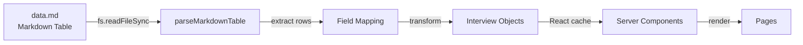
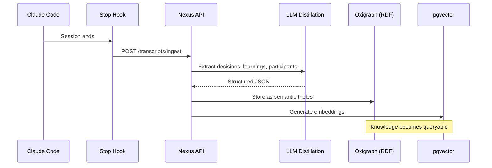

# ZAR Retail Payment Survey

A Next.js application for exploring field research data from retail payment method interviews conducted across South Africa. Built with the "Field Notes" editorial design aesthetic.

## Quick Start

```bash
npm install
npm run dev    # http://localhost:3000
```

## Architecture

```mermaid
flowchart TB
    subgraph Data Layer
        MD[src/data/data.md<br/>Markdown Table]
        LIB[src/lib/interviews.ts<br/>Parser + Cache]
        TR[transcripts/*.txt<br/>Raw transcripts]
        FL[src/lib/founder-insights.ts<br/>Founder metrics + evidence]
    end

    subgraph Pages
        HOME[/ Dashboard]
        LIST[/interviews List]
        DETAIL[/interviews/id Detail]
        ANALYSIS[/analysis Report]
        FOUNDERS[/founders Founder Dashboard]
    end

    subgraph Components
        DASH[dashboard/*<br/>StatCard, Charts]
        INT[interviews/*<br/>Cards, Transcript]
        UI[interviews/ui/*<br/>Badge, SectionCard]
    end

    MD -->|read at build| LIB
    LIB -->|getInterviews| HOME
    LIB -->|getInterviews| LIST
    LIB -->|getInterviewById| DETAIL
    LIB -->|getInterviews| ANALYSIS
    MD -->|read at build| FL
    TR -->|read at build| FL
    FL -->|getFounderDashboardData| FOUNDERS

    HOME --> DASH
    LIST --> INT
    DETAIL --> INT
    DETAIL --> UI
    ANALYSIS --> UI
```

### Data Flow



The single source of truth is `src/data/data.md`, a markdown table containing all interview data. The `src/lib/interviews.ts` module parses this file server-side using Node's `fs` module and caches results with React's `cache()` function. The founder dashboard also reads raw interview transcripts from `transcripts/*.txt` via `src/lib/transcripts.ts`.

### Design System

Uses CSS custom properties defined in `src/app/globals.css`:

| Variable | Purpose |
|----------|---------|
| `--paper`, `--paper-warm` | Card/section backgrounds |
| `--ink`, `--ink-light`, `--ink-muted` | Text hierarchy |
| `--accent-rust`, `--accent-terra`, `--accent-ochre`, `--accent-sage`, `--accent-slate` | Accent colors |
| `--shadow-paper`, `--shadow-card` | Elevation |

Typography loaded via `next/font`: Crimson Text (serif headings), DM Sans (body), JetBrains Mono (code).

## Nexus Integration

This project integrates with [Nexus](https://nexus.zar.app), ZAR's organizational knowledge distillation service. Nexus captures Claude Code session transcripts, Slack threads, GitHub PR discussions, and other knowledge sources, distilling them into a queryable semantic graph.

### How It Works



### Setup

1. **Configure the Claude Code hook** (runs automatically when sessions end):

   Create `~/.claude/hooks/stop.sh`:
   ```bash
   #!/bin/bash
   TRANSCRIPT=$(cat "$CLAUDE_TRANSCRIPT_FILE")
   SESSION_ID="$CLAUDE_SESSION_ID"

   curl -X POST "$NEXUS_URL/transcripts/ingest" \
     -H "Authorization: Bearer $NEXUS_API_KEY" \
     -H "Content-Type: application/json" \
     -d "{
       \"content\": $(echo "$TRANSCRIPT" | jq -Rs .),
       \"source\": \"claude_code\",
       \"session_id\": \"$SESSION_ID\",
       \"project\": \"zar\"
     }"
   ```

2. **Authenticate** (first time only):
   ```bash
   # Opens browser for GitHub OAuth
   curl -X POST "$NEXUS_URL/device/authorize"
   ```

3. **Configure MCP server** in your Claude Code settings to query Nexus during sessions:
   ```json
   {
     "mcpServers": {
       "nexus": {
         "url": "https://nexus.zar.app/mcp"
       }
     }
   }
   ```

### Querying Knowledge

With the MCP server configured, Claude Code can query organizational memory:

- `nexus_ontology()` - Explore available entity types
- `nexus_recent(type: "Decision")` - Recent architectural decisions
- `nexus_search("authentication")` - Semantic similarity search
- `nexus_query("SELECT ?d WHERE { ?d a nx:Decision }")` - SPARQL queries

### What Gets Captured

Every Claude Code session on this project automatically captures:
- **Decisions**: Architectural choices with rationale
- **Learnings**: Insights and lessons discovered
- **Participants**: People and AI agents involved
- **Topics**: Concepts and technologies discussed

This enables queries like "What decisions have we made about the payment data model?" or "Show me learnings related to the transcript parser."

## Commands

| Command | Purpose |
|---------|---------|
| `npm run dev` | Development server |
| `npm run build` | Production build |
| `npm run lint` | ESLint |

## Stack

- Next.js 16, React 19
- Tailwind CSS v4
- Recharts for data visualization
- TypeScript
