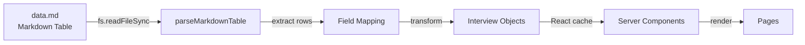
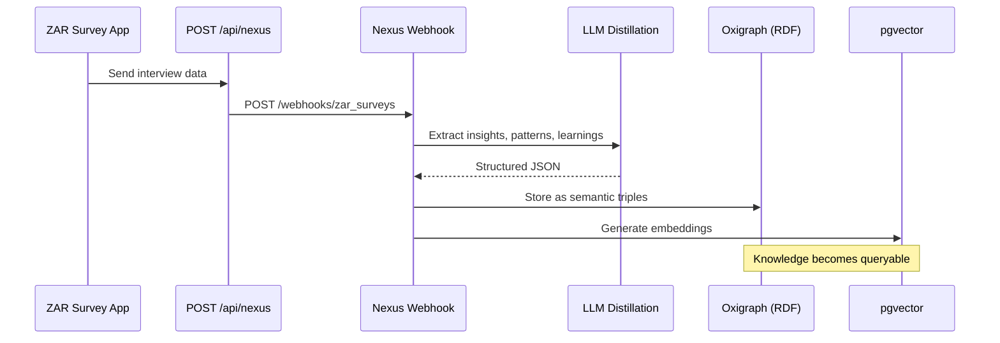

# ZAR Retail Payment Survey

A Next.js application for exploring field research data from retail payment method interviews conducted across Pakistan. Built with the "Field Notes" editorial design aesthetic.

## Quick Start

```bash
npm install
npm run dev    # http://localhost:3000
```

## Architecture

```mermaid
flowchart TB
    subgraph Data Layer
        MD[src/data/data.md<br/>Markdown Table]
        LIB[src/lib/interviews.ts<br/>Parser + Cache]
        TR[transcripts/*.txt<br/>Raw transcripts]
        FL[src/lib/founder-insights.ts<br/>Founder metrics + evidence]
    end

    subgraph Pages
        HOME[/ Dashboard]
        LIST[/interviews List]
        DETAIL[/interviews/id Detail]
        ANALYSIS[/analysis Report]
        FOUNDERS[/founders Founder Dashboard]
    end

    subgraph Components
        DASH[dashboard/*<br/>StatCard, Charts]
        INT[interviews/*<br/>Cards, Transcript]
        UI[interviews/ui/*<br/>Badge, SectionCard]
    end

    MD -->|read at build| LIB
    LIB -->|getInterviews| HOME
    LIB -->|getInterviews| LIST
    LIB -->|getInterviewById| DETAIL
    LIB -->|getInterviews| ANALYSIS
    MD -->|read at build| FL
    TR -->|read at build| FL
    FL -->|getFounderDashboardData| FOUNDERS

    HOME --> DASH
    LIST --> INT
    DETAIL --> INT
    DETAIL --> UI
    ANALYSIS --> UI
```

### Data Flow



The single source of truth is `src/data/data.md`, a markdown table containing all interview data. The `src/lib/interviews.ts` module parses this file server-side using Node's `fs` module and caches results with React's `cache()` function. The founder dashboard also reads raw interview transcripts from `transcripts/*.txt` via `src/lib/transcripts.ts`.

### Design System

Uses CSS custom properties defined in `src/app/globals.css`:

| Variable | Purpose |
|----------|---------|
| `--paper`, `--paper-warm` | Card/section backgrounds |
| `--ink`, `--ink-light`, `--ink-muted` | Text hierarchy |
| `--accent-rust`, `--accent-terra`, `--accent-ochre`, `--accent-sage`, `--accent-slate` | Accent colors |
| `--shadow-paper`, `--shadow-card` | Elevation |

Typography loaded via `next/font`: Crimson Text (serif headings), DM Sans (body), JetBrains Mono (code).

## Nexus Integration

This project sends interview data to [Nexus](https://nexus.zar.app), ZAR's organizational knowledge distillation service. Nexus uses a **Universal Webhook Processor** that accepts any JSON payload and uses AI to extract meaningful content, storing it as a queryable semantic graph.

### How It Works



### Setup

1. **Get your API key** by running the device authorization flow:
   ```bash
   curl -X POST "https://nexus.zar.app/device/authorize"
   ```
   This opens your browser for GitHub OAuth. Once authorized, your token is saved locally.

2. **Configure environment variables** in `.env.local`:
   ```
   NEXUS_API_KEY=your-api-key
   NEXUS_WEBHOOK_URL=https://nexus.zar.app/webhooks/zar_surveys
   ```

### Sending Interview Data

```bash
# Send a single interview
curl -X POST http://localhost:3000/api/nexus \
  -H "Content-Type: application/json" \
  -d '{"interview_id": "1"}'

# Send all interviews (bulk)
curl -X POST http://localhost:3000/api/nexus \
  -H "Content-Type: application/json" \
  -d '{"all": true}'

# Send raw content
curl -X POST http://localhost:3000/api/nexus \
  -H "Content-Type: application/json" \
  -d '{"content": "Your content here..."}'

# Check configuration status
curl http://localhost:3000/api/nexus
```

### What Gets Captured

The Universal Webhook Processor extracts from interview transcripts:
- Fraud incidents and patterns
- Payment method adoption insights
- Trust factors and concerns
- Currency exchange behaviors
- Key phrases about money and trust

This enables queries like "What fraud patterns have shopkeepers reported?" or "What concerns do merchants have about mobile payments?"

## Commands

| Command | Purpose |
|---------|---------|
| `npm run dev` | Development server |
| `npm run build` | Production build |
| `npm run lint` | ESLint |

## Stack

- Next.js 16, React 19
- Tailwind CSS v4
- Recharts for data visualization
- TypeScript
